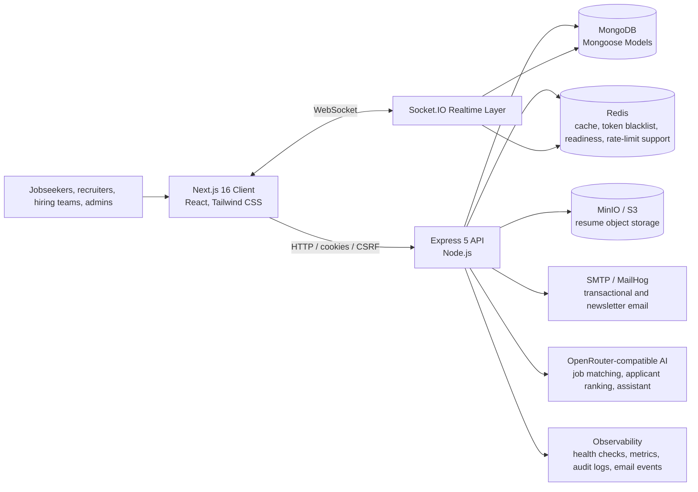
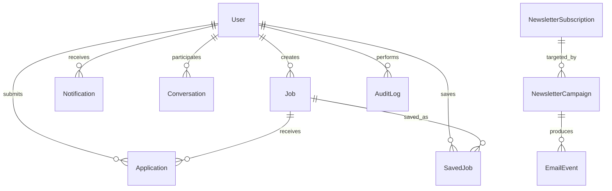
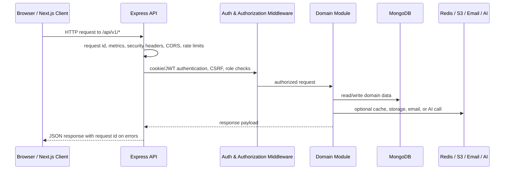
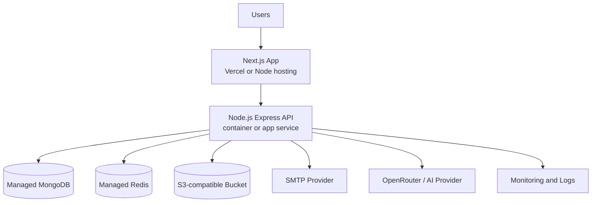

# HireNova Architecture

HireNova is an AI-powered full-stack hiring platform for jobseekers, recruiters,
hiring teams, admins, and superadmins. The system is built as a production-aware
portfolio application with a Next.js client, an Express API, MongoDB persistence,
Redis-backed support services, S3-compatible resume storage, email delivery,
realtime messaging, AI-assisted matching, and automated verification.

## System Overview



## Runtime Architecture

The frontend is a Next.js application in `client/` that serves public marketing
pages, authentication screens, job browsing, account pages, employer tools, and
admin dashboards. It communicates with the backend through the versioned API
base path `/api/v1` and uses Socket.IO for realtime notification and messaging
updates.

The backend is a modular Express application in `src/`. `src/index.js` creates
the HTTP server, initializes Socket.IO, validates runtime configuration,
connects MongoDB and Redis, and starts the API process. `src/app.js` owns the
core middleware chain, health routes, API route mounting, 404 handling, and
global error reporting.

Local infrastructure is provided by Docker Compose:

- MongoDB for primary application data.
- Redis for cache/realtime support and production rate-limit readiness.
- MinIO for local S3-compatible resume storage.
- MailHog for local email testing.
- Mongo Express and Redis Commander for local inspection.

## API Modules

The API is grouped by business capability under `src/modules/`:

| Module | Responsibility |
| --- | --- |
| `auth` | Signup, login, logout, email confirmation, password reset, profile updates, resume upload/download, employer role requests |
| `users` | Shared user lookup and account operations |
| `jobs` | Job creation, search, filters, updates, approval, status changes, recommendations |
| `applications` | Job applications, applicant review, application status updates, AI applicant ranking |
| `saved-jobs` | Jobseeker saved job workflow |
| `companies` | Company profile and public company details |
| `candidates` | Candidate discovery for recruiters/admins |
| `messages` | Conversations and direct message workflows |
| `notifications` | User notifications and read/read-all states |
| `dashboard` | Summary data for role-based dashboards |
| `admin` | User management, role approvals, job approvals, newsletters, audit logs, email events, system monitor |
| `newsletters` | Public subscription and campaign support |
| `assistant` | AI assistant chat endpoint |

All modules are mounted through `src/routes/v1/index.js`, keeping the public API
surface versioned and easy to evolve.

## Data Model

MongoDB is the source of truth for platform data through Mongoose models:

- `User`
- `Job`
- `Application`
- `SavedJob`
- `Notification`
- `Conversation`
- `NewsletterSubscription`
- `NewsletterCampaign`
- `AuditLog`
- `EmailEvent`

Core relationships:



Resume files are stored outside MongoDB in S3-compatible object storage. MongoDB
keeps metadata and references, while MinIO/S3 stores the file objects under the
configured resume bucket.

## Request Flow



## AI Workflows

HireNova uses an OpenRouter-compatible chat completion integration for AI
features while keeping deterministic fallback behavior in the backend.

- Smart job recommendations score jobs against user skills, experience,
  location preferences, and search intent.
- Applicant ranking scores candidates against a job using skills, experience,
  location, cover letter signals, and profile completeness.
- The assistant module exposes an AI chat endpoint for hiring and job-search
  support.

If the AI provider is unavailable, the recommendation and ranking services still
return useful deterministic scores and reasons.

## Realtime Architecture

Socket.IO is initialized on the same HTTP server as the Express API. Realtime
connections authenticate with the existing access token from either socket auth,
an authorization header, or the auth cookie. Each authenticated user joins a
private room using the pattern `user:{userId}`.

This supports user-scoped realtime events such as:

- New notifications.
- Message updates.
- Account or workflow events that should appear without a full page refresh.

## Security Architecture

Security is handled across middleware, data access, and runtime configuration:

- HttpOnly cookie authentication with JWT verification.
- CSRF protection for browser-based state-changing requests.
- Role-based authorization for jobseeker, employer, admin, and superadmin
  workflows.
- Account status checks to block inactive users.
- Helmet security headers, CORS allowlists, payload size limits, HPP protection,
  and rate limiting.
- Token blacklist support through Redis for logout/session invalidation.
- Production environment validation that fails fast for missing secrets,
  placeholder values, invalid CORS, and missing Redis-backed rate limiting.
- Audit logging for sensitive successful actions without storing raw request
  bodies or raw IP addresses.

## Observability

The backend includes lightweight production-readiness observability:

- `/health/live` for process liveness.
- `/health/ready` for MongoDB and Redis readiness.
- `/health` for uptime and request metric snapshots.
- Structured request logging.
- Request metrics for volume, status classes, API errors, and slow requests.
- Persisted audit logs for sensitive actions.
- Persisted email events with hashed recipients and delivery duration.
- Admin system monitor views for operational visibility.

For multi-instance production deployments, request metrics and alerts should be
moved to centralized tooling such as Prometheus/Grafana, Datadog, Better Stack,
or a cloud provider monitoring stack.

## Deployment Topology



In local development, Docker Compose replaces managed infrastructure with
MongoDB, Redis, MinIO, and MailHog containers. In production, those services can
be replaced with managed equivalents while preserving the same environment
contract.

## Verification

The repository includes backend unit tests, frontend utility tests, lint/build
checks, Playwright E2E tests, accessibility checks, visual regression coverage,
and production-readiness documentation.

Primary verification commands:

```bash
npm run check:backend
npm --prefix client run check
npm run check:all
```
